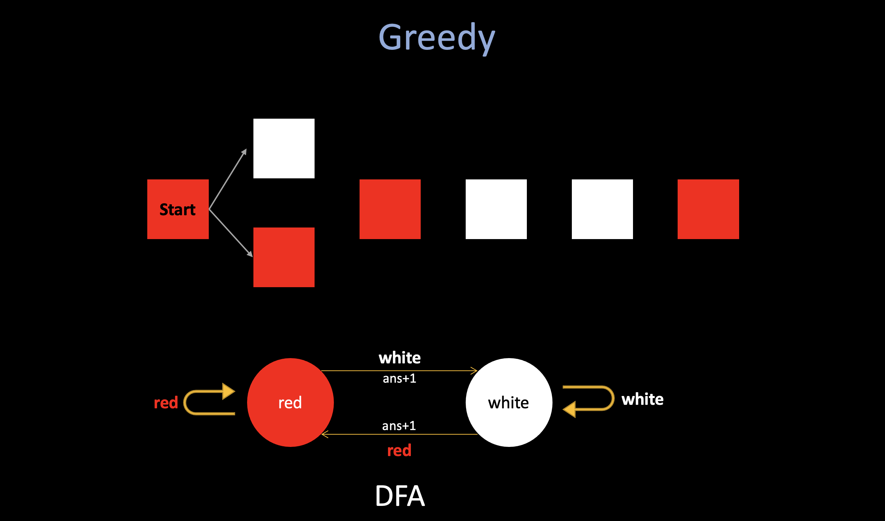

# Codeforces Round #809 (Div.2) Tutorial

## 1706A. Another String Minimization Problem (Greedy)

Let's iterate through the elements of a. For convenience, we'll make ai = min(ai ,m+1−ai). If the ai-th character of s is not currently A, then we should replace it. Otherwise, we replace the (m+1−ai)-th character. **"Smaller first, if smaller is taken, then replace the bigger one"**.

* My Solution: **[164751915](https://codeforces.com/contest/1706/submission/164751915)**
* Editorial Solution: **[164799099](https://codeforces.com/contest/1706/submission/164799099)**


## 1706B. Making Towers (DP, Greedy)

First of all, if we have two blocks of the same color at indices i and j such that i < j, how can we tell if it is possible to place them at (xi, yi) and (xi, yi + 1) respectively?

As it turns out, they can be placed like this **if and only if i and j have different parities**, (parity is the property of an integer of whether it is even or odd).
As you can imagine, if there are odd number of colored blocks between i and j, then jth block can be placed above ith.

### 1. DP

The DP is quite a normal solution, but I didn't come up with that during the contest. Since there are only two parities (odd and even) or colored blocks (their positions), we should only care about those two. 

* Here is the DP structure: **`dp[oe][c]` stands for the maximum # of blocks building of color `c` of parity `oe`**.
* Here is the state-trans function: **`dp[oe][c] = max(dp[oe][c], dp[eo][c] + 1)`** (the **`eo`** means the oppsite of **`oe`**).

```cpp
  for (int i = 1; i <= n; i++) {
    int x; cin >> x; // x := current color
    dp[i & 1][x] = max(dp[i & 1][x], dp[(i ^ 1) & 1][x] + 1);
  }
```

In this problem, since in each iteration, we only can in one state: **odd/even parities**. And notice that all these states are predefined. **So each action (pick/not pick this block will never cause the state to be changed), and if the state will be changed, we need to consider them independently (pick/not pick), just like we did in [698A. Vacations](https://codeforces.com/problemset/problem/698/A)**.

This solution runs in linear time. 

* My Solution: **[165298559](https://codeforces.com/contest/1706/submission/165298559)**

### 2. Greedy

Alternatively, there is a greedy solution. **After selecting a block, the next block selected must always have the opposite parity.**

Imagine a sequencial scan of all the colored blocks: Let's say the red blocks stand for even, the white blocks stand for odd, if we use greedy, the question will be: **"will the greedily selection at each position affect future selection, and make the answer not optimal?"**

The answer should be no, if the first block is in even position (red), and next is in odd position, if we greedily choose it, and then we are in white state. If we do not choose it, and waiting for a "better" position to choose it later, let's say we meet another white state, and we believe wait until here to choose it will lead a better result, then after we choose it, in that white state, we are no difference than choose that white earlier, and potentialy we lose some "white to red"
transaction between it.



To sum up, **it makes sense to greedily select the first block of the same color with opposite parity, since it will never improve the answer if we select a later block.**

* My Solution: **[165325194](https://codeforces.com/contest/1706/submission/165325194)**

## 1706C. Qpwoeirut And The City (prefix sum)
 
This problem requires you to think about it before actually writing some code. First, when N buildings in the city, there should have maximum **`(N-1)/2`** cool buildings. There are two cases:

1. For **odd** N, there is only one way to achieve the maximum # of cool buildings, **just need to find the total floors necessary to make each of the alternating buildings (starting from the 2nd building) cool and that is the answer.**

2. For **even** N, to achieve the maximum # of cool buildings, we should make only one choice, which means in only one chance, we can "give up" the ith building (maybe it is too relatively expensive to build) and then choose i+1. 

For the second case, since we can only make one choice, the states are limited, we do not need to use dp: **just consider each possibilities:**

For example, in the 4th test case from the example in the problem statement, the possible configurations of cool buildings are...

(light — normal (not cool) building, **bold** — cool building)

* 4 **2** 1 **3** 5 **3** 6 1
* 4 **2** 1 **3** 5 3 **6** 1
* 4 **2** 1 3 **5** 3 **6** 1
* 4 2 **1** 3 **5** 3 **6** 1

* 1st configuration: (5 - 2) + (6 - 3) + (7 - 3) = 10.
* 2nd configuration: 10 - (7 - 3) + (6 - 6) = 6.
* 3rd configuration: 6 - (6 - 3) + (5 - 5) = 3.
* 4th configuration: 3 - (5 - 2) + (4 - 1) = 3.

For even n, the floors necessary for every configuration can also be found in O(n) time using an alternating **forward prefix sum array** and an alternating **backward prefix sum array**.

* My Solution:  **[165490020](https://codeforces.com/contest/1706/submission/165490020)**


